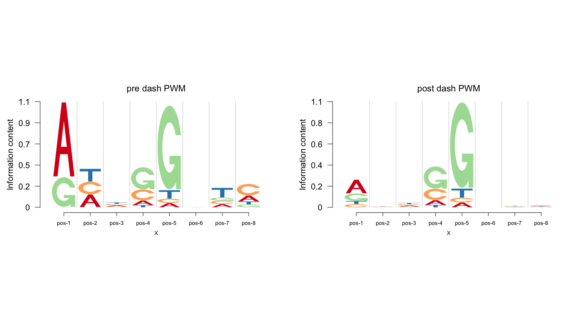

# dash - Dirichlet adaptive shrinkage for compositional data


- Authors:    [Kushal K Dey](https://github.com/kkdey),         [Matthew Stephens](http://stephenslab.uchicago.edu/)


## Introduction

We present here a R package for fitting an adaptive method to shrink compositional
counts data. We assume the input to be compositional counts with samples along columns
and the composition categories along the rows. The method fits a multinomial model
on each column, but we choose an adaptive prior - a mixture Dirichlet distribution with
a given background probability as mean and concentration parameter ranging from very
high values to very low values (even less than 1). The mixture proportions of the 
Dirichlet prior are estimated from the data.

## Model Formulation

We model these compositional counts vectors as follows 

$$ (c_{n1}, c_{n2}, \cdots, c_{nL}) \sim Mult \left ( c_{n+} : p_{n1}, p_{n2}, \cdots, p_{nL} \right )  $$

where $c_{n+}$ is the total frequency of the different constituents of the compositional data observed for the $n$ th base. $p_{nl}$ here represents the compositional probabilities such that 

$$ p_{nl}  >= 0 \hspace {1 cm} \sum_{l=1}^{L} p_{nl} = 1  $$

The prior for the composition probabilties is given below.

$$ \left ( p_{n1}, p_{n2}, \cdots, p_{nL} \right ) : = \sum_{k=1}^{K} \pi_{k} Dir \left (\alpha_{k} \mu_{k1}, \alpha_{k} \mu_{k2}, \cdots, \alpha_{k} \mu_{kL} \right )  \hspace {1 cm} \alpha_{k} > 0 \hspace{1 cm}  \sum_{l=1}^{L} \mu_{kl} = 1 $$

We assume a prior of $\pi_{k}$ to be Dirichlet 

$$ f(\pi) : = \prod_{k=1}^{K} {\pi_{k}}^{\lambda_{k}-1} $$

Such a prior is similar to the **ash** prior introduced by Stephens (2016) for modeling False discovery rates in normal data, and we call it the **dash** prior.

To see how we choose the model concentration values and details on the estimation of the mode, check our Vignette.

##  Example Applications of dash 

We first provide an example application of **dash** in shrinking the base compositional probabilities in a Trasncription Factor Binding Site (TFBS) for a particular transcription factor. 

```{r,warning=FALSE,message=FALSE,fig.width=7,fig.height=7}
library(Logolas)
library(grid)
library(gridBase)
library(ecostructure)
library(ggplot2)
library(Biobase)
library(dash)
```

We provide a simulation example of a position frequency matrix (PFM). 

```{r,warning=FALSE,message=FALSE,fig.width=7,fig.height=7}

xmat <- cbind(c(5, 0, 2, 0),
              c(1, 1, 0, 1),
              c(100, 100, 50, 100),
              c(20, 50, 100, 10),
              c(10, 10, 200, 20),
              c(50, 54, 58, 53),
              c(1,1,1,3),
              c(2, 4, 1, 1))
rownames(xmat) <- c("A", "C", "G", "T")
colnames(xmat) <- paste0("pos-", 1:dim(xmat)[2])
xmat_norm <- apply(xmat, 2, function(x) return(x/sum(x)))

xmat
```

We fit the Dirichlet adaptive shrinkage (dash) model to the position frequency matrix generated above.


```{r,warning=FALSE,message=FALSE,fig.width=7,fig.height=7}
out <- dash(xmat, optmethod = "mixEM", verbose=FALSE, bf=TRUE)
```


We present the logo plot representations of the PWM matrix obtained by normalizing the sample PFM matrix and the one after applying dash. We use the R package [Logolas](kkdey.github.io/Logolas-pages) to visually represent the logos. 

```{r}
grid.newpage()
layout.rows <- 1
layout.cols <- 2
top.vp <- viewport(layout=grid.layout(layout.rows, layout.cols,
                                      widths=unit(rep(6,layout.cols), rep("null", 2)),
                                      heights=unit(c(20,50), rep("lines", 2))))

plot_reg <- vpList()
l <- 1
for(i in 1:layout.rows){
  for(j in 1:layout.cols){
    plot_reg[[l]] <- viewport(layout.pos.col = j, layout.pos.row = i, name = paste0("plotlogo", l))
    l <- l+1
  }
}


plot_tree <- vpTree(top.vp, plot_reg)

color_profile = list("type" = "per_row", 
                     "col" = RColorBrewer::brewer.pal(4,name ="Spectral"))

pushViewport(plot_tree)
seekViewport(paste0("plotlogo", 1))
logomaker(xmat_norm,color_profile = color_profile,
          frame_width = 1,
          pop_name = "pre dash PWM",
          newpage = F)

seekViewport(paste0('plotlogo',2))
logomaker(out$posmean,color_profile = color_profile,
          frame_width = 1,
          pop_name = "post dash PWM",
          newpage = F)
```




